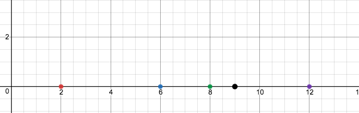
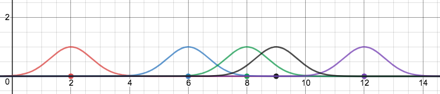
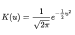
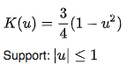
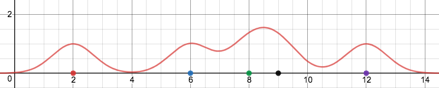

# Kernel Density Estimation

---
### Objectives
We want to be able to understand the questions:
* What is a kernel?
* How can kernels be used to estimate density?
* How can the R package TDA be of use in doing so?
* What are a few useful applications of kernel density estimation?
- - - 
# What is a kernel?
To begin, visualize a number line with points lying along it, as follows:
---

---
Now, above each point we can insert a Gaussian curve
---

------
---
We call the curves inserted above these points kernels. In this example, we've chosen to use Gaussian curves as kernels, 
though other implementations include:
* Rectangular kernels
* Triangular kernels
* Biweight kernels
* Uniform kernels
* Cosine kernels
* Epanechnikov kernels

#### However, for functional purposes we are primarily concerned with Gaussian and Epanechnikov kernels specifically. We've seen some exposure to Gaussian kernels, and Epanechnikov kernels are conceptually quite similar but are parabolic rather than normally distributed in nature.
* Gaussian kernels are specifically useful since they are naturally distributed. This yields a natural sort of probability in location for each data point, and when taken as a sum of all the points in a data set is actually quite effective in representing the data. A Gaussian kernel K(u) is defined to be: 
     - 
* Epanechnikov kernels are useful in their own right, and are representative of data in a manner similar to Gaussian kernels. However, the difference in Epanechnikov kernels lies in their parabolic structure. The function for an Epanechnikov kernel K(u) is defined as: 
    - 
---
Summing all of our Gaussian kernels together, we gain a nice visualization of the densities of the original points on the number line
---

##
Conceptually, this is the central goal of kernel density estimation. In order to understand the density of data, it is incredibly useful to project their densities in some manner above a set in order to view similarities in their values. Adding dimensions, for an n dimensional set of data, we find an n + 1 dimensional kernel density estimate. Thus, for a set of 2 dimensional data, we can construct a similar density visualization in R3
---
//TODO add diagram in R3 probably just with calcplot or something?

---
## Applications of kde
Kernel density estimation is widely applicable as a relatively intuitive, nonparametric method to model the structure of a data set. Below are just a few of countless applications kde can have
### Econometrics
* Understanding the probability involved with economic data. Econometricians can utilize kde in order to understand the overall trends in economic data, in hopes to explain the root causes of economic trends.
[kde econometrics paper](https://arxiv.org/abs/1212.2812 "kde in econometrics")
### GIS
* kde is immediately applicable to any sort of map, as it is an easy way to understand the densities of a particular phenomenon in a space

---
## kde in the R package 'TDA'
[R package](https://www.rdocumentation.org/packages/TDA/versions/1.6.2/topics/kde "kde R Documentation")
---

